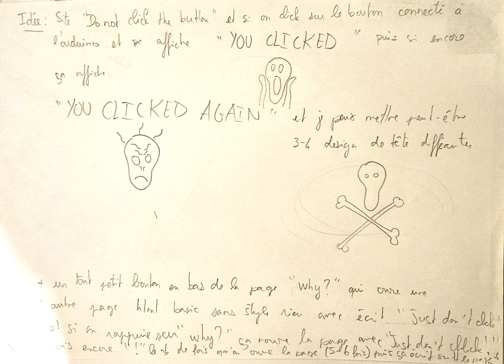
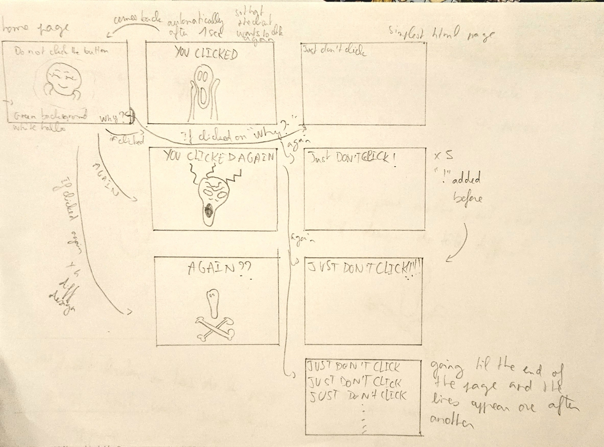
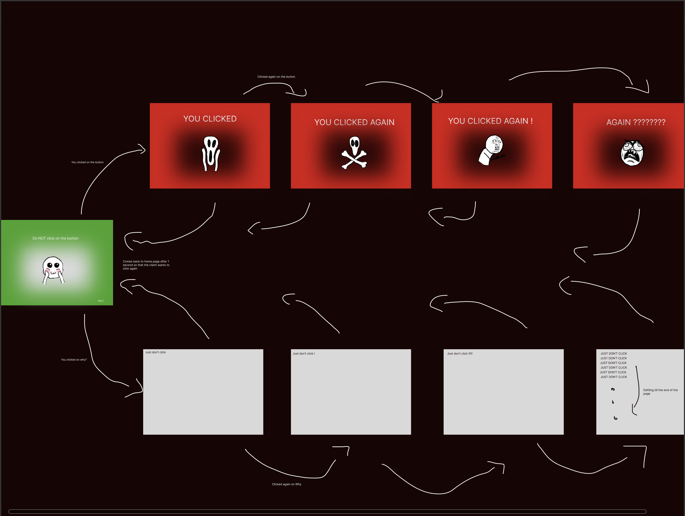
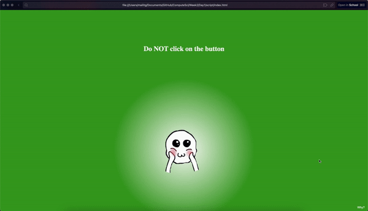
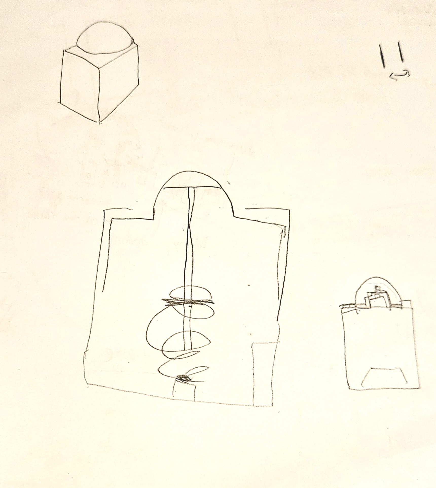

# CS Project

> For this week we had to implement a websocket server with a web interface. Learning on the way, HTML, CSS, JS and the basics of UI. 

The first day I learned how to do a websocket and to interact on a small website where I received messages from the server and from the website send to the server. So the next step towards the project was just to have the idea to implement what I had just learned. 

So first I took out a paper and a pen and thought of a sort of "crap" website with "crappy" design with "crappy" images I would draw on paint for a useless "connected object".

Now that I had the idea I did a quick design.

Then I did it on figma to have a better idea of the proportions and interactions, I also did the drawings on gimp.

Now, all that was left was to do the coding.

The website was now functional I wanted to accentuate the "uselessness" of my "connected object -ish" as well as to give the client even more the need to press the button so I did a quick design on paper

and then on fusion 360 with enough space to place the esp32, the button at the bottom to be pressed and holes for the cable and here it was ***The Holy Button.

![3Dbutton](./assets/Buttonanim.gif

